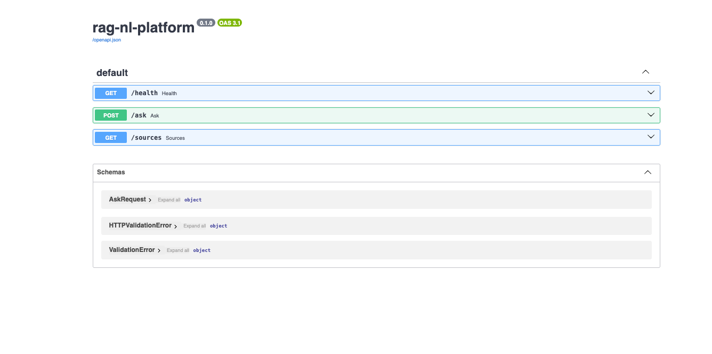
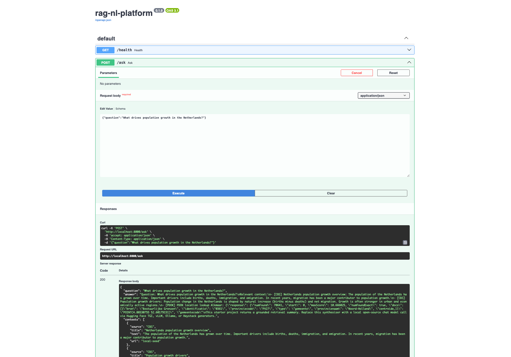

# rag-nl-platform


An open-source, Dockerized Retrieval-Augmented Generation platform for Netherlands-focused data use cases.

This project was designed as a practical, extensible RAG starter kit: light enough to run locally, structured enough to grow into a broader platform, and opinionated enough to demonstrate a modern open-source stack without locking you into a single vector database, framework, UI, or model family.

At its core, **rag-nl-platform** ingests Dutch open data, embeds text into vectors, stores and retrieves context through a pluggable retrieval layer, and exposes an API and UI for grounded question answering. Around that core is a wider scaffold for orchestration, ranking, alternate vector stores, multiple frontends, and Kubernetes deployment. In other words: what runs today is intentionally useful, and what is scaffolded is intentionally expandable.

---

## Why this project exists

The RAG ecosystem changes quickly. New embedding models appear every month, vector databases compete on speed and ergonomics, and orchestration frameworks each solve a slightly different problem. Instead of treating that churn as a problem, this project treats it as a design principle.

**rag-nl-platform** uses an open-source-first architecture that can be extended over time:
- swap the vector backend without rewriting the whole application
- start with local embeddings and later move to larger open models
- run everything in Docker for development, then extend it for Kubernetes
- begin with a minimal API + retrieval path, then add Airflow, Kubeflow, NiFi, rerankers, and local LLM serving as your use case matures

That makes it suitable for demos, internal accelerators, research prototypes, data product experiments, and platform engineering proof-of-concepts.

---

## Tech stack

### Ingest & data processing
- Kubeflow *(scaffolded)*
- Apache Airflow *(scaffolded DAGs)*
- Apache NiFi *(scaffolded integration point)*
- LangChain loaders *(integration-ready)*
- Haystack pipelines *(scaffolded/optional)*
- OpenSearch *(integration-ready)*

### Retrieval & ranking
- Elasticsearch *(integration-ready)*
- Weaviate *(integration-ready)*
- FAISS *(integration-ready/local option)*
- Jina AI rerankers *(scaffolded)*
- Haystack retrievers *(scaffolded/optional)*

### Embedding models
- Hugging Face Transformers
- Sentence Transformers
- Jina AI *(extensible target)*
- Cognita *(scaffolded target)*
- Nomic *(extensible target)*
- LLMWare *(extensible target)*

### Vector databases
- Qdrant **(implemented default path)**
- Milvus *(scaffolded target)*
- Weaviate *(integration-ready)*
- PgVector *(integration-ready)*
- Chroma *(scaffolded target)*

### LLM frameworks
- LangChain
- Haystack *(optional/scaffolded path)*
- CrewAI *(scaffolded target)*
- Hugging Face ecosystem
- LlamaIndex

### Model families
- LLaMA *(target family)*
- Mistral *(target family)*
- Phi-2 *(target family)*
- DeepSeek *(target family)*
- Qwen *(target family)*
- Gemma *(target family)*

### Frontend options
- Next.js **(implemented UI path)**
- Streamlit **(implemented UI path)**
- Vue.js *(scaffolded target)*
- SvelteKit *(scaffolded target)*

---

## Datasets

The project is oriented around open datasets from the Netherlands and can be extended to additional Dutch or EU public data sources.

Example dataset targets include:
- **CBS / Statistics Netherlands** for demographics, economy, and social indicators
- **PDOK** for Dutch geospatial and location data
- **Rijkswaterstaat** for water, mobility, and infrastructure-related data

The implementation should avoid indexing raw transport errors or dead sample endpoints as knowledge. For best results, curate clean domain documents or validate API responses before embedding them.

---

## What is implemented vs scaffolded

### Implemented now
- FastAPI backend
- `/sources` and `/ask` API endpoints
- Qdrant-backed vector retrieval path
- Sentence Transformers embeddings
- Docker-based local execution flow
- bootstrap ingestion path
- Next.js frontend shell
- Streamlit frontend shell
- Makefile-based developer workflow

### Scaffolded / extension points
- Apache Airflow orchestration DAGs
- Kubeflow pipeline integration
- Apache NiFi ingestion integration
- Haystack alternative pipelines and retrievers
- CrewAI orchestration patterns
- Jina reranking
- Elasticsearch / OpenSearch / Weaviate / PgVector / FAISS alternative retrieval paths
- local LLM serving through Hugging Face TGI, vLLM, or Ollama
- Kubernetes deployment manifests and scaling patterns

The guiding idea is simple: **run the core locally first, then widen the stack as needed**.

---

## Repository layout

```text
rag-nl-platform/
├── apps/
│   ├── api/                  # FastAPI service, retrieval logic, API routes
│   ├── web/                  # Next.js frontend
│   └── streamlit/            # Streamlit frontend
├── dags/                     # Airflow DAG scaffolds
├── kubeflow/                 # Kubeflow pipeline stubs
├── nifi/                     # NiFi flow placeholders / notes
├── k8s/                      # Kubernetes manifests and deployment scaffolds
├── scripts/                  # Ingestion and helper scripts
├── data/                     # Local seed data and staged input files
├── docker/                   # Optional Docker assets and service definitions
├── requirements.txt          # Core Python dependencies
├── requirements-optional-haystack.txt
├── docker-compose.yml        # Local multi-service run configuration
├── Makefile                  # Convenience commands
└── README.md
```

---

## Clone the project

```bash
git clone git@github.com:hlosukwakha/rag-nl-platform.git
cd rag-nl-platform
```

---

## Run locally with Docker

The intended local developer flow is:

```bash
make build
make up
make ingest
```

### What these commands do
- `make build` builds the Docker images
- `make up` starts the API, vector store, and UI services
- `make ingest` runs the bootstrap ingestion process to load the initial corpus

After that, use the API or browser UIs to ask questions against the indexed corpus.

---

## Kubernetes readiness

The project is designed so the local Docker flow can evolve into Kubernetes deployment.

That means you can:
- keep the FastAPI service as the application entrypoint
- run Qdrant and other components as separate services
- move ingestion and pipeline tasks into Airflow, Kubeflow, or Jobs/CronJobs
- add ingress, secrets, config maps, autoscaling, and storage classes later

In short, the project runs locally today and can be extended to run in **Kubernetes** as the platform matures.

---

## API endpoints
<p align="center">
  
</p>

- **Swagger UI:** `http://localhost:8000/docs`
- **Sources:** `http://localhost:8000/sources`
- **Ask:** `http://localhost:8000/ask`
---

## Sample API usage

### 1) Inspect configured sources

```bash
curl -s http://localhost:8000/sources | jq .
```

Example output:

```json
{
  "collection": "nl_open_data",
  "vector_backend": "qdrant",
  "configured_models": [
    "LLaMA",
    "Mistral",
    "Phi-2",
    "DeepSeek",
    "Qwen",
    "Gemma"
  ],
  "frameworks": [
    "LangChain",
    "Haystack",
    "CrewAI",
    "HuggingFace",
    "LlamaIndex"
  ]
}
```

### 2) Ask a question

```bash
curl -s -X POST "http://localhost:8000/ask" \
  -H "Content-Type: application/json" \
  -d '{"question":"What drives population growth in the Netherlands?"}' | jq .
```

Example output:

```json
{
  "question": "What drives population growth in the Netherlands?",
  "answer": "Question: What drives population growth in the Netherlands?\nRelevant context:\n- [CBS] Netherlands population growth overview: The population of the Netherlands has grown over time. Important drivers include births, deaths, immigration, and emigration. In recent years, migration has been a major contributor to population growth.\n- [CBS] Population growth drivers: Population change in the Netherlands is shaped by natural increase (births minus deaths) and net migration. Growth is often stronger in urban and economically active regions.\nThis starter project returns a grounded retrieval summary. Replace this synthesiser with a local open-source chat model call via Hugging Face TGI, vLLM, Ollama, or Haystack generators.",
  "contexts": [
    {
      "source": "CBS",
      "title": "Netherlands population growth overview",
      "text": "The population of the Netherlands has grown over time. Important drivers include births, deaths, immigration, and emigration. In recent years, migration has been a major contributor to population growth.",
      "url": "local-seed"
    },
    {
      "source": "CBS",
      "title": "Population growth drivers",
      "text": "Population change in the Netherlands is shaped by natural increase (births minus deaths) and net migration. Growth is often stronger in urban and economically active regions.",
      "url": "local-seed"
    }
  ]
}
```

### 3) Ask from a script or terminal pipeline

```bash
QUESTION='What does CBS-style population data say about migration and growth in the Netherlands?'
curl -s -X POST "http://localhost:8000/ask" \
  -H "Content-Type: application/json" \
  -d "{\"question\":\"${QUESTION}\"}" | jq -r '.answer'
```
#### Using Swagger UI:
<p align="center">
  
</p>
---

## Development notes

- The current default execution path uses **Qdrant + Sentence Transformers + FastAPI**.
- The listed frameworks and model families are part of the platform design, but not all are active in the core runtime path yet.
- Haystack should be treated as an optional integration path unless dependency versions are aligned with the rest of the stack.
- Retrieval quality depends heavily on corpus quality. Clean ingestion matters more than adding more frameworks.

---

## Extending the platform

Good next steps include:
- replacing the summariser with a local open-source chat model
- adding reranking before final synthesis
- indexing curated CBS datasets instead of placeholder payloads
- supporting alternate vector stores through configuration
- adding authentication, tracing, evaluation, and feedback loops
- promoting the Docker deployment to Kubernetes manifests with persistent volumes and ingress

---

## License

This project is licensed under the **Apache License 2.0**.

---

**@hlosukwakha**
